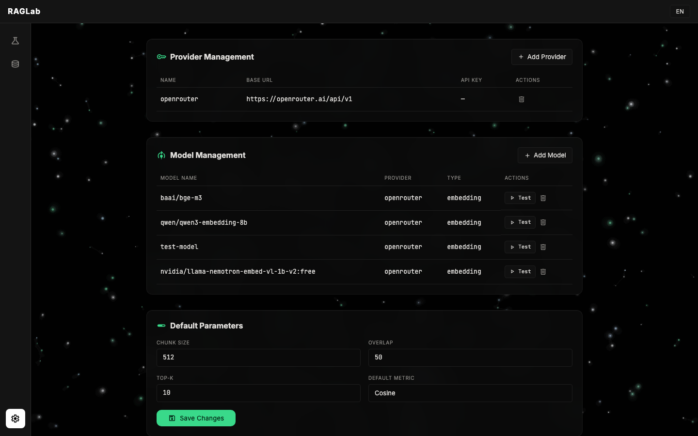
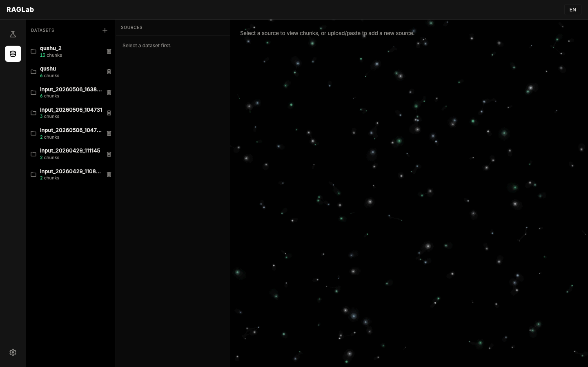
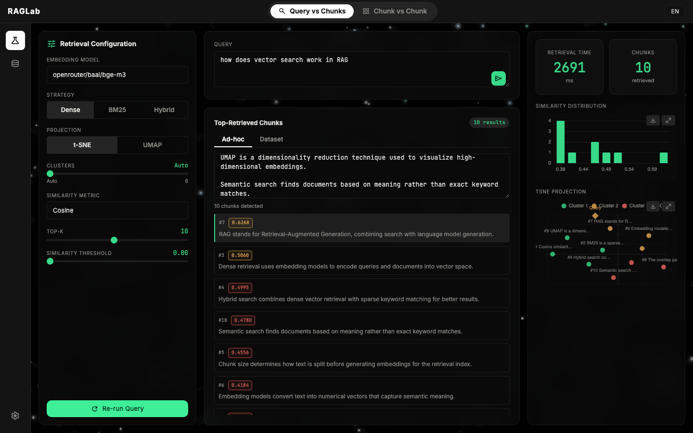
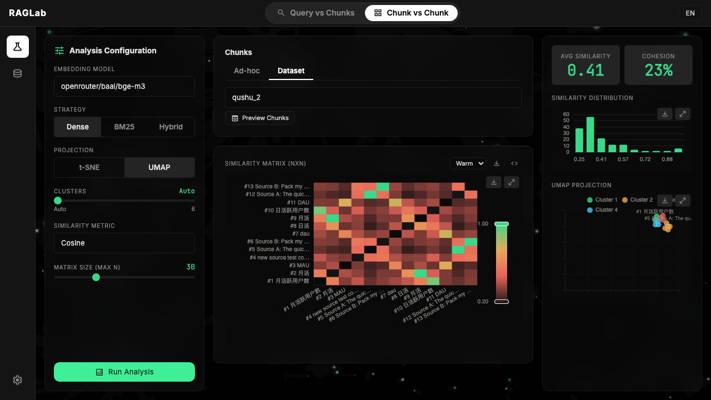

# RAGLab

Before committing to an embedding model, you need to test it on your own data. RAGLab does that — runs locally, data stays on your machine, one command to start.

**[中文](README_zh.md)** · **[Agent Reference](README_agent.md)**

---

## What it looks like

**Settings** — configure providers and models (any OpenAI-compatible endpoint works)



**Datasets** — manage your test corpus, upload files or paste text directly



**Playground** — run queries, ranked results with similarity scores, live distribution histogram and t-SNE/UMAP semantic cluster view



**Chunk vs Chunk** — full pairwise similarity heatmap across your corpus, spot redundant or tightly clustered chunks at a glance



---

## Install

Requires Python 3.10+.

```bash
pip install raglab
raglab serve
```

Open http://localhost:8099. Data persists in `~/.raglab.db` between sessions. For UMAP projection: `pip install umap-learn`.

---

## Getting started

**1. Add a provider**

Go to Settings, enter your API Key and Base URL. Any OpenAI-compatible endpoint works — OpenRouter, Alibaba Bailian, OpenAI, or a self-hosted service. OpenRouter's base URL is `https://openrouter.ai/api/v1` if you want to test a wide range of models quickly.

**2. Add models**

One provider can have multiple models. Click Add Model in Settings, enter the model name as the provider expects it (e.g. `baai/bge-m3`). Hit Test to verify it responds.

**3. Prepare a dataset**

In Datasets, create a dataset and paste or upload your documents. They get chunked automatically using the chunk size you configure in Settings.

**4. Run evaluations in Playground**

- **Query vs Chunks**: type a query, pick a model and retrieval strategy (Dense / BM25 / Hybrid). You get ranked results, a similarity distribution histogram, and a UMAP/t-SNE projection of the chunk space.
- **Chunk vs Chunk**: pick a dataset, get a full pairwise similarity heatmap. Useful for spotting redundant chunks or understanding how semantically clustered your corpus is.

---

## CLI

Everything the UI does is also available from the command line:

```bash
# Provider setup
raglab provider add openrouter --api-key sk-xxx --base-url https://openrouter.ai/api/v1
raglab provider list

# Models
raglab model list
raglab model test --model baai/bge-m3

# Chunking
raglab split doc.txt --strategy recursive --chunk-size 512

# Scoring
raglab score "what is RAG" chunks.txt --model baai/bge-m3
raglab compare "what is RAG" chunks.txt --models baai/bge-m3,qwen/qwen3-embedding-8b

# Similarity matrix
raglab matrix chunks.txt --model baai/bge-m3

# Test cases
raglab case add mytest chunks.txt
raglab case run mytest
```

---

## Retrieval strategies

| Strategy | Notes |
|----------|-------|
| Dense | Vector similarity, requires an embedding model |
| BM25 | Sparse term-frequency retrieval, no model needed |
| Hybrid | Weighted combination of both |

Similarity metrics: Cosine, Dot Product, Euclidean, Manhattan.

---

## Data and privacy

Everything — including API keys — is stored locally in `~/.raglab.db`. Nothing is sent anywhere except the embedding API calls you explicitly configure. API keys are stored in plaintext; make sure your home directory has appropriate permissions.
